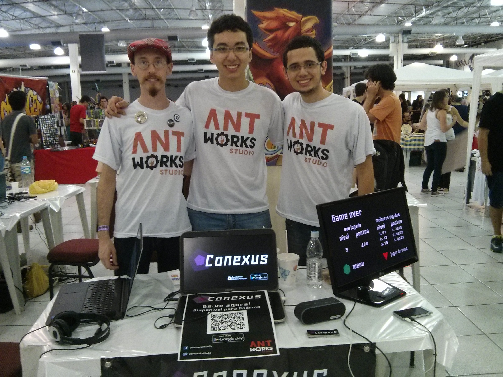
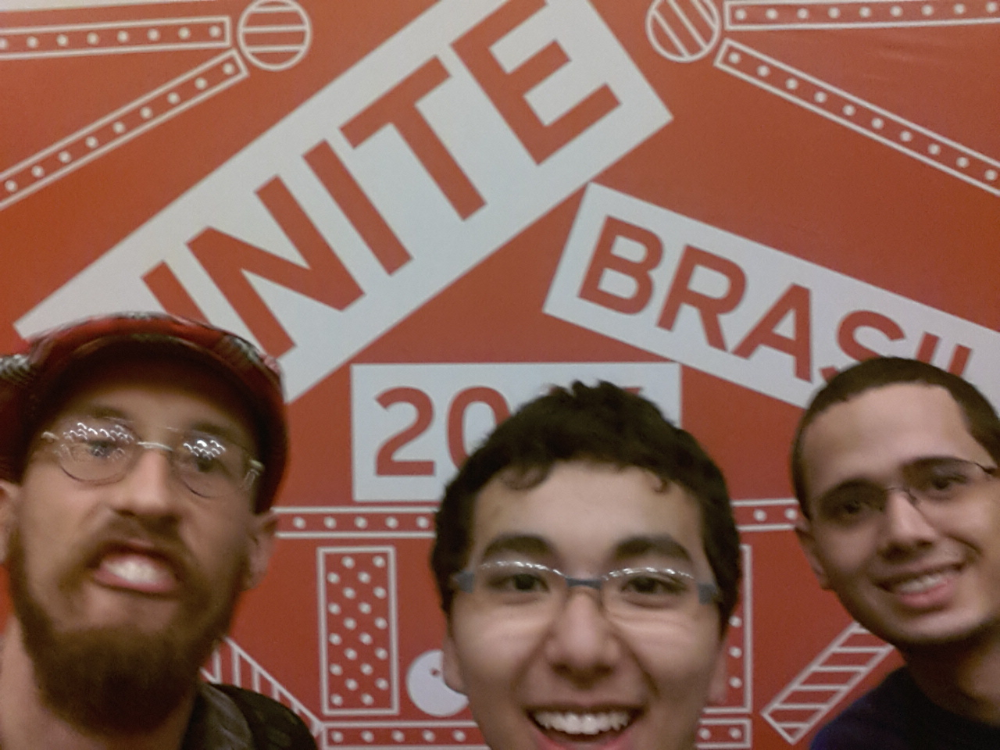
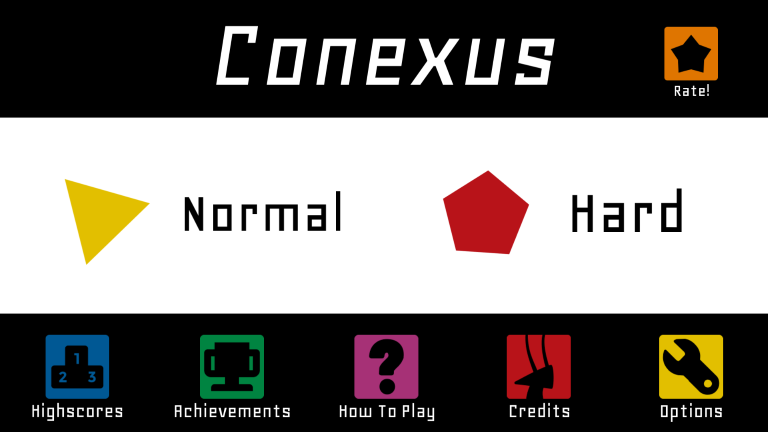
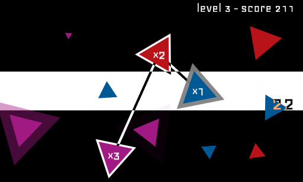
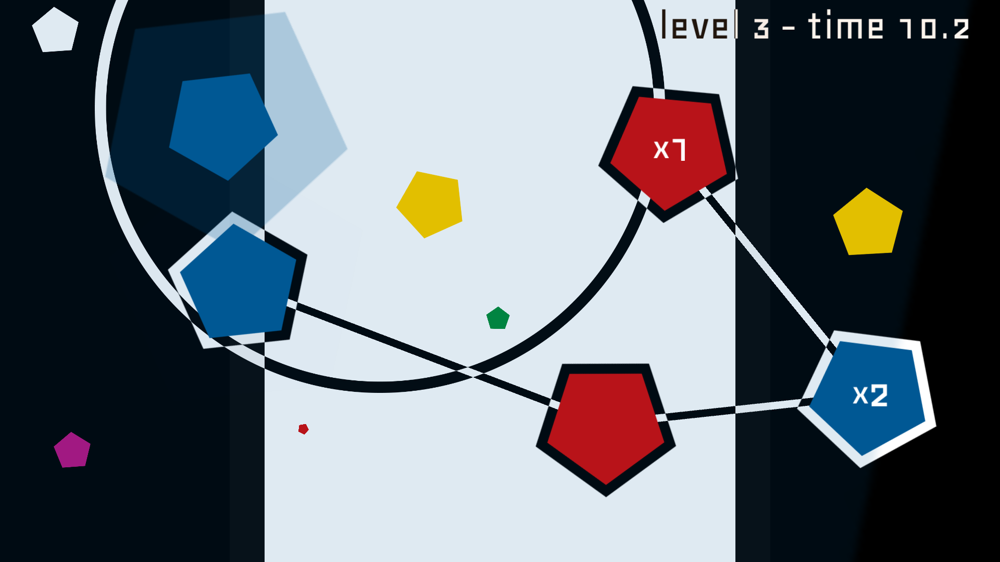
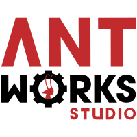
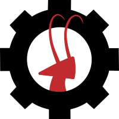

# 

## Informações

**Desenvolvedora:**  
Antworks Studio

**Fundação:**  
29 de Abril de 2012

**Website:**  
[antworks.itch.io][homepage]

**Contato:**  
[antworks.studio@gmail.com][contact]

**Social:**  
[twitter.com/AntworksStudio][twitter]  
[facebook.com/AntworksStudio][facebook]

**Publicações:**  
[Conexus][conexus]
[Figurado][figurado]

**Localização:**  
Campinas, São Paulo  
Brasil

## Descrição

A Antworks Studio é um pequeno estúdio de jogos composto de três estudantes da Unicamp unidos pelo gosto em comum por jogos.

## História

Em 2012, depois de muito quebrar a cabeça com diversas ferramentas e nenhuma experiência no ramo, os três co-fundadores encontraram a game engine Unity e a partir daí começaram a desenvolver seus primeiros projetos. O primeiro jogo veio apenas em 2013, o Conexus, resultado de uma game jam local.  
Hoje, a Antworks Studio se prepara para novos projetos e ideias, buscando jogos desafiantes, porém, acima de tudo, divertidos.

## Projetos

* [Conexus][conexus]

## Vídeos

Este é o trailer de lançamento do Conexus. [Youtube](https://www.youtube.com/watch?v=t_kxMv8dIdc "Conexus Trailer on Youtube")  

<iframe src="//www.youtube.com/embed/HMNE6rF1UA8" frameborder="0" allowfullscreen></iframe>
 

## Imagens

Download das imagens em ** [.zip (63 KB)](assets/images/images.zip "Images zip") **

## Logo & Ícone

Download das imagens em ** [.zip (7 KB)]( assets/images/logo.zip "Logo & Icon zip") **

## Equipe

**Renato Landim Vargas**  
[Co-Fundador]

**Victor Rodrigues Matsuguma**  
[Co-Fundador]

**Vinícius Pimentel Couto**  
[Co-Fundador]

## Contato

**Perguntas**  
[antworks.studio@gmail.com][contact]

**Twitter**  
[twitter.com/AntworksStudio][twitter]

** Facebook**  
[facebook.com/AntworksStudio][facebook]

**Web**  
[antworks.itch.io][homepage]

<!--- =====================================================================  -->
<!--- Referenced links -->

[homepage]: http://antworks.itch.io "Antworks Studio"

[contact]: mailto:antworks.studio@gmail.com

<!--- Social -->

[twitter]: https://twitter.com/AntworksStudio
[facebook]: https://facebook.com/AntworksStudio

<!--- Projects  -->

[conexus]: projects/conexus/
[figurado]: projects/figurado/
