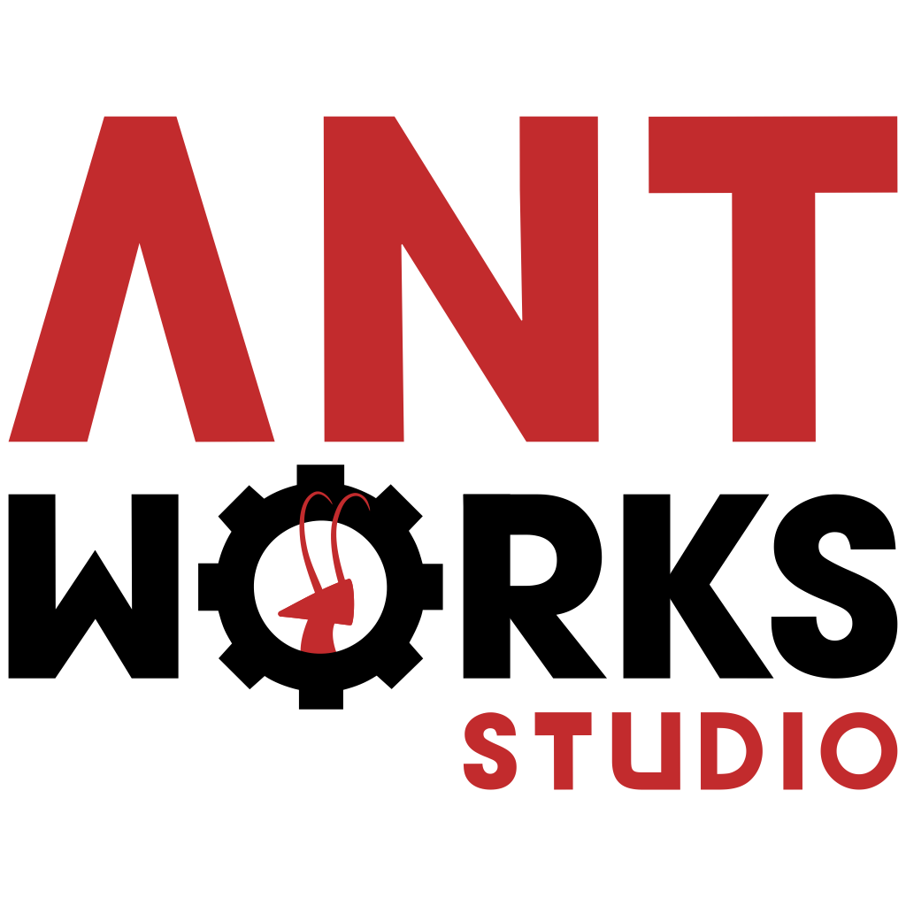

# 

## Informações

**Desenvolvedora:**  
Antworks Studio

**Fundação:**  
29 de Abril de 2012

**Website:**  
[antworks.itch.io][homepage]

**Contato:**  
[antworks.studio@gmail.com][contact]

**Social:**  
[twitter.com/AntworksStudio][twitter]  
[facebook.com/AntworksStudio][facebook]

**Publicações:**  
[Conexus][conexus]  
[Figurado][figurado]  
[Supermax][supermax]

**Localização:**  
Campinas, São Paulo  
Brasil

## Descrição

A Antworks Studio é um pequeno estúdio de jogos composto de três estudantes da Unicamp unidos pelo gosto em comum por jogos.

## História

Em 2012, depois de muito quebrar a cabeça com diversas ferramentas e nenhuma experiência no ramo, os três co-fundadores encontraram a game engine Unity e a partir daí começaram a desenvolver seus primeiros projetos. O primeiro jogo veio apenas em 2013, o <b>Conexus</b>, resultado de uma game jam local.  
Algum tempo depois, seu segundo jogo, <b>Figurado</b>, foi muito bem recebido e indicado a "Melhor Jogo Educacional ou de Aprendizado" no <i>BIG Festival 2016</i>.  
Ainda em 2016, a Antworks Studio foi vencedora da Brasil Game Jam, e foi contactada pela Rede Globo para o desenvolvimento do jogo <b>Supermax</b>.

## Projetos

* [Conexus][conexus]  
* [Figurado][figurado]  
* [Supermax][supermax]

## Vídeos

Comercial do jogo, transmitido na Rede Globo, no [Youtube](https://www.youtube.com/watch?v=LeBPqaJGaZU "Comercial Supermax")  

<iframe src="https://www.youtube.com/embed/LeBPqaJGaZU" frameborder="0" allowfullscreen></iframe>
 

Este é o trailer do Figurado no [Youtube](https://youtu.be/XIj8S7WgDdY "Figurado Trailer on Youtube")
<iframe src="https://www.youtube.com/embed/XIj8S7WgDdY" frameborder="0" allowfullscreen></iframe>
 

Este é o trailer de lançamento do Conexus no [Youtube](https://www.youtube.com/watch?v=t_kxMv8dIdc "Conexus Trailer on Youtube")  
<iframe src="//www.youtube.com/embed/HMNE6rF1UA8" frameborder="0" allowfullscreen></iframe>
 

## Imagens

Download das imagens em ** [.zip (2,91 MB)](assets/images/images.zip "Images zip") **

## Logo & Ícone

Download das imagens em ** [.zip (430 KB)]( assets/images/logo.zip "Logo & Icon zip") **

## Equipe

**Renato Landim Vargas**  
[Co-Fundador]

**Victor Rodrigues Matsuguma**  
[Co-Fundador]

**Vinícius Pimentel Couto**  
[Co-Fundador]

## Contato

**Perguntas**  
[antworks.studio@gmail.com][contact]

**Twitter**  
[twitter.com/AntworksStudio][twitter]

** Facebook**  
[facebook.com/AntworksStudio][facebook]

**Web**  
[antworks.itch.io][homepage]

<!--- =====================================================================  -->
<!--- Referenced links -->

[homepage]: http://antworks.itch.io "Antworks Studio"

[contact]: mailto:antworks.studio@gmail.com

<!--- Social -->

[twitter]: https://twitter.com/AntworksStudio
[facebook]: https://facebook.com/AntworksStudio

<!--- Projects  -->

[conexus]: projects/conexus/
[figurado]: projects/figurado/
[supermax]: projects/supermax/
