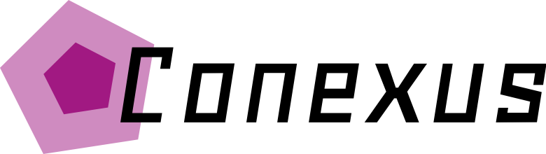
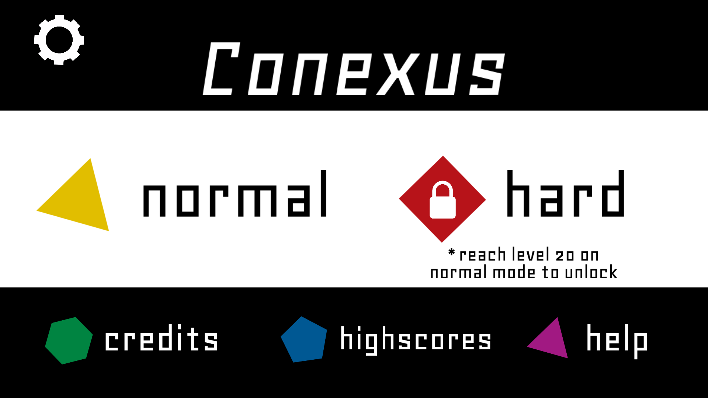
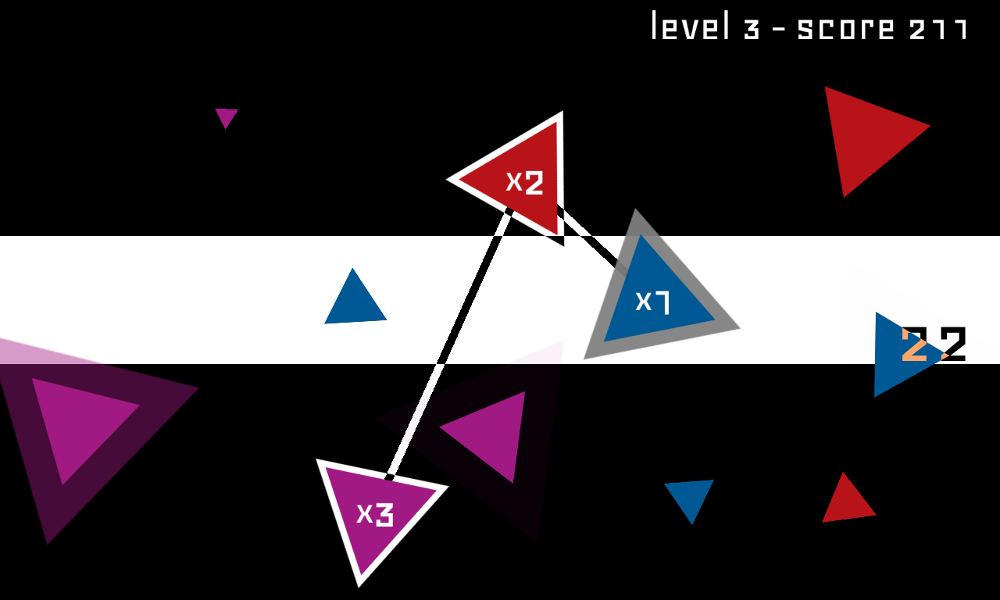
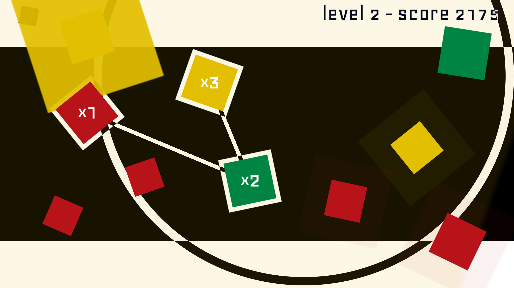
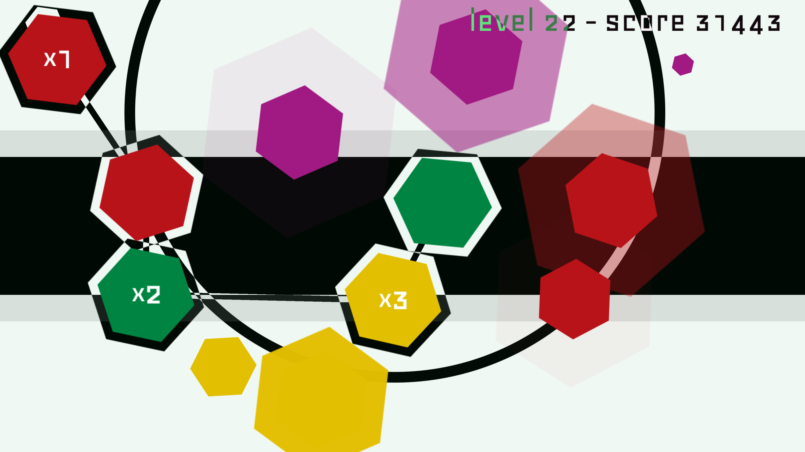
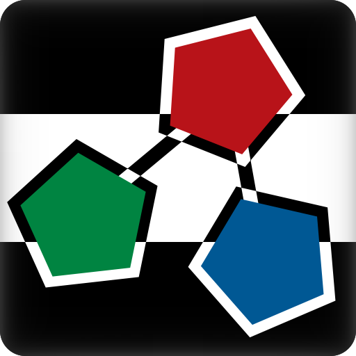

# 

## Informações

**Desenvolvedora:**  
Antworks Studio

**Lançamento**  
28 de Novembro de 2014

**Plataformas:**  
[Android](https://play.google.com/store/apps/details?id=com.AntworksStudio.Conexus)  
[Windows Phone](http://www.windowsphone.com/s?appid=f7167c39-278e-41b8-b59e-8b52a485b40d)

**Website:**  
[Conexus at itch.io](http://antworks.itch.io/conexus)

**Preço:**  
Free

## Descrição

Conecte as formas geométricas na tela e forme ciclos!  
Conexus exige velocidade, habilidade e raciocínio rápido para conectar as formas que pulam freneticamente pela tela ao som de uma música igualmente frenética.

## História
Primeiro jogo comercial da Antworks Studio, o Conexus foi resultado da Campjam de 2013, uma game jam local na cidade de Campinas. Inspirado no tema "café", apresentado por uma imagem de uma molécula de cafeína, o jogo se inspirou na molécula para conectar os objetos, e nos efeitos da cafeína para a velocidade frenética. Além disso, a equipe sendo composta apenas de programadores levou à utilização de simples formas geométricas.  
Depois de ter chamado bastante atenção na game jam, o estúdio decidiu continuar o desenvolvimento do jogo, que se alongou por vários meses devido a demais compromissos.  
No início de 2014, com o feedback recebido de membros da IGDA (Independent Game Developers Association) e de participantes de diversos eventos, o jogo passou por diversas modificações até chegar à sua forma atual, dita simples, porém difícil e viciante.

## Features

* Jogabilidade frenética.
* Dois modos de jogo.
* Partidas rápidas.
* Cores vibrantes.
* Ranking local.

## Vídeos

Trailer de lançamento. [Youtube](https://www.youtube.com/watch?v=HMNE6rF1UA8 "Conexus Trailer on Youtube")  

<iframe src="//www.youtube.com/embed/HMNE6rF1UA8" frameborder="0" allowfullscreen></iframe>
 

Vídeo de gameplay. [Youtube](https://www.youtube.com/watch?v=dBg3E4SiYFY "Conexus gameplay on Youtube")

<iframe src="//www.youtube.com/embed/dBg3E4SiYFY" frameborder="0" allowfullscreen></iframe>
 

Demo de tutoriais. [Youtube](https://www.youtube.com/watch?v=NwiiKDIAPP0 "Conexus tutorial demo on Youtube")

<iframe src="//www.youtube.com/embed/NwiiKDIAPP0" frameborder="0" allowfullscreen></iframe>
 

## Imagens

Download dos screenshots em ** [.zip (63 KB)](assets/images/images.zip "Images zip") **

## Logo & Ícone

Download das imagens em ** [.zip (7 KB)]( assets/images/logo.zip "Logo & Icon zip") **

## Créditos do Projeto

**Renato Landim Vargas**  
[Desenvolvedor]

**Victor Rodrigues Matsuguma**  
[Desenvolvedor]

**Vinícius Pimentel Couto**  
[Desenvolvedor]

## Contato

**Perguntas**  
[antworks.studio@gmail.com][contact]

**Twitter**  
[twitter.com/AntworksStudio][twitter]

** Facebook**  
[facebook.com/AntworksStudio][facebook]

**Web**  
[antworks.itch.io][homepage]

<!--- =====================================================================  -->
<!--- Referenced links -->

[homepage]: http://antworks.itch.io "Antworks Studio"

[contact]: mailto:antworks.studio@gmail.com

<!--- Social -->

[twitter]: https://twitter.com/AntworksStudio
[facebook]: https://facebook.com/AntworksStudio
