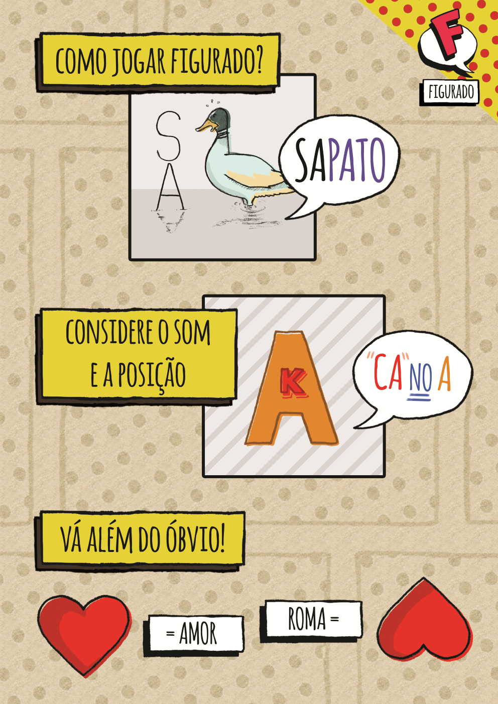

# 

## Informações

**Desenvolvedora:**  
[Antworks Studio](https://http://antworksstudio.github.io/presskit)

**Lançamento**  
28 de Fevereiro de 2016

**Plataformas:**  
[Android](https://play.google.com/store/apps/details?id=com.Antworks.rebus)  
[iOS](https://itunes.apple.com/us/app/figurado/id1074391059)

**Preço:**  
Free

## Nome
**Figurado**

## Descrição

Encontre a palavra escondida em cada quadrinho do gibi!  
Figurado é um jogo que exige imaginação, raciocínio e criatividade. A cada quadrinho, uma imagem diferente esconde uma palavra: tente descobrir qual é.  

## História
Através do jogo Rebus, conhecemos o passatempo chamado rébus, que consiste em exprimir palavras através de imagens e símbolos, e o conjunto deles revela a solução. Convencidos de se tratar de um passatempo divertido e dada a inexistência de um jogo com rébus em língua portuguesa, a Antworks Studio decidiu fazer desse o seu segundo projeto comercial.  
Em parceria com Pedro Almeida, amigo pessoal do estúdio, e munidos dos muitos aprendizados da produção do Conexus, o jogo começou sua produção em Novembro de 2015.

## Features

* Desafios criativos.
* Jogabilidade simples.
* Visual agradável.
* Compartilhamento em redes sociais.
* Atualizações periódicas.

## Imagens

Download dos screenshots em ** [.zip (4.22MB)](assets/images/images.zip "Images zip") **

## Ícone e Header

Download das imagens em ** [.zip (3.18KB)](assets/images/icons.zip "Icons zip") **

## Créditos do Projeto

**Pedro Almeida**  
[Artista]

**Victor Rodrigues Matsuguma**  
[Desenvolvedor]

**Vinícius Pimentel Couto**  
[Desenvolvedor]

## Contato

**Perguntas**  
[antworks.studio@gmail.com][contact]

**Twitter**  
[twitter.com/AntworksStudio][twitter]

** Facebook**  
[facebook.com/AntworksStudio][facebook]

**Web**  
[antworks.itch.io][homepage]

<!--- =====================================================================  -->
<!--- Referenced links -->

[homepage]: http://antworks.itch.io "Antworks Studio"

[contact]: mailto:antworks.studio@gmail.com

<!--- Social -->

[twitter]: https://twitter.com/AntworksStudio
[facebook]: https://facebook.com/AntworksStudio
