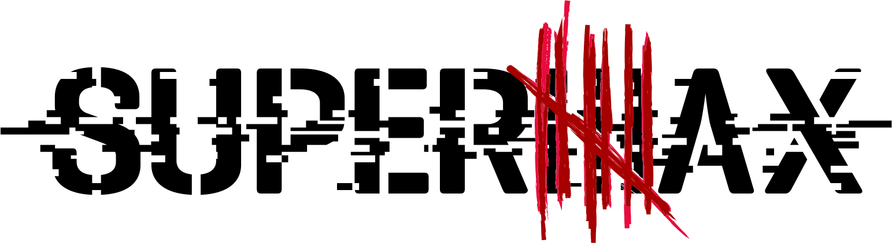
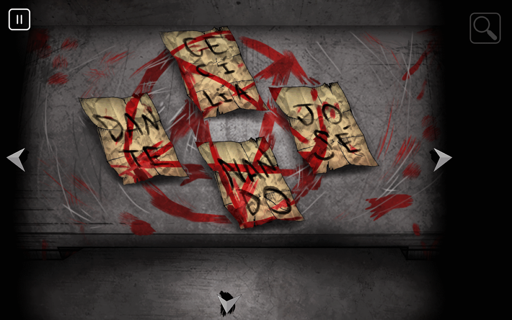
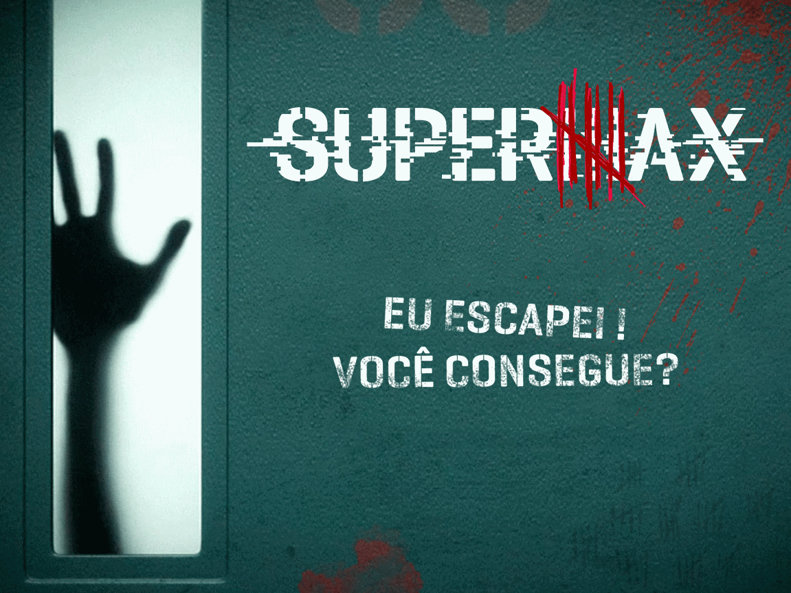
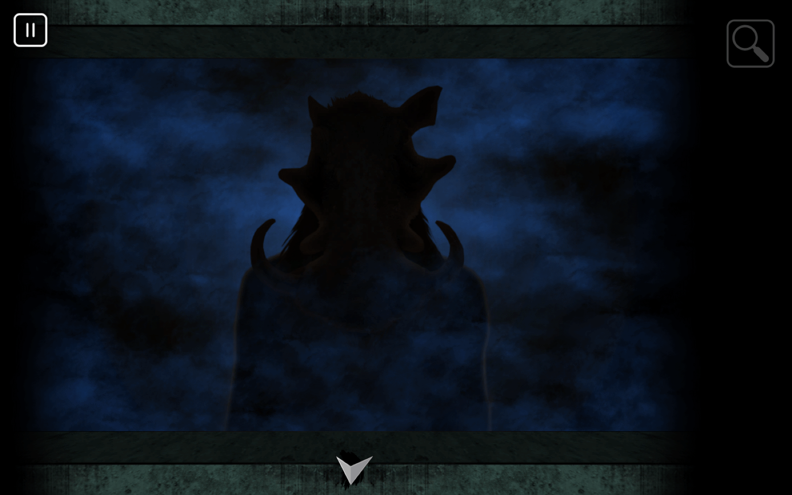
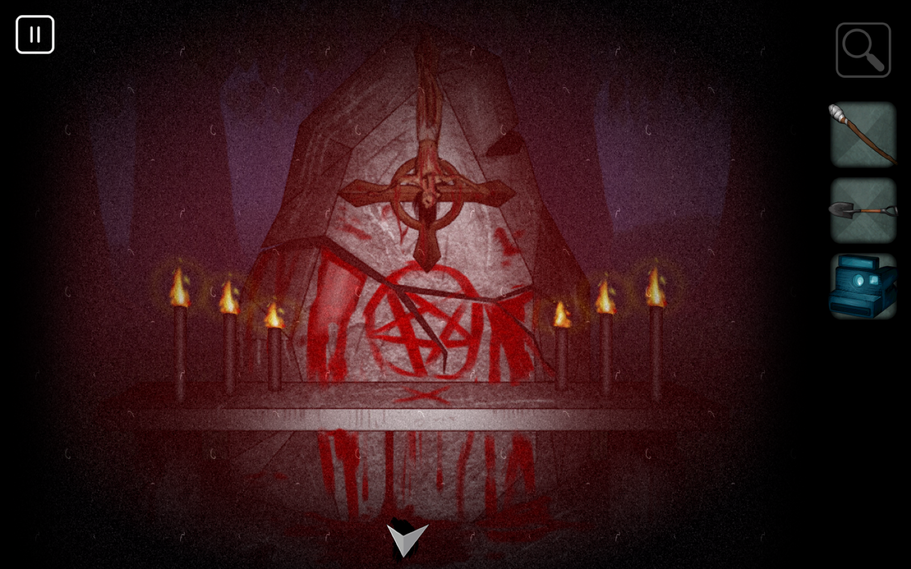
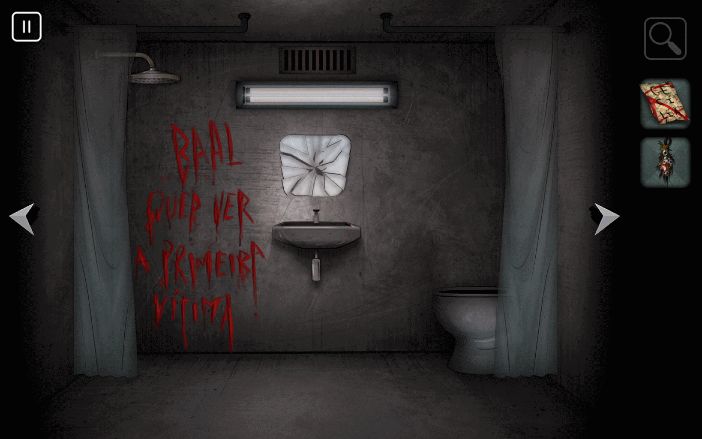
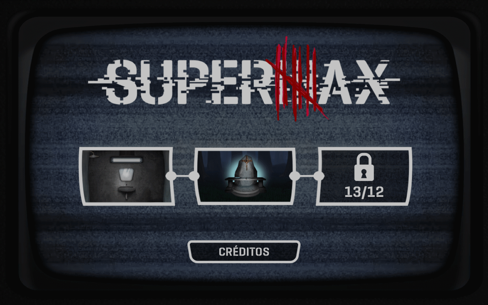
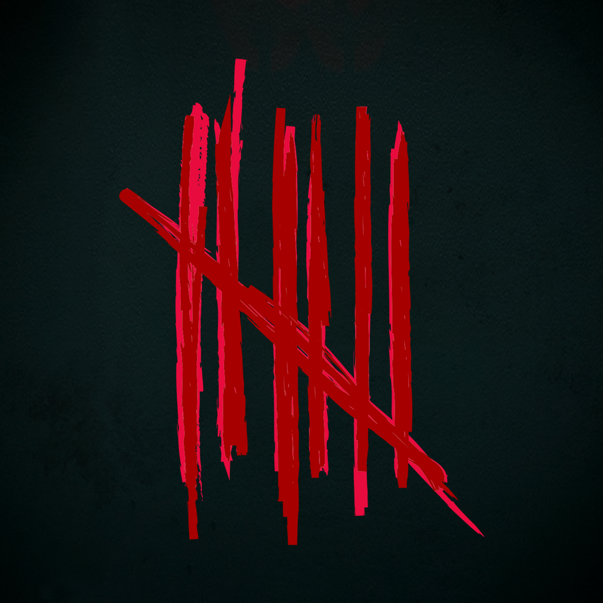

# 

## Informações

**Desenvolvedora:**  
Antworks Studio

**Lançamento**  
29 de Novembro de 2016

**Plataformas:**  
[Android](https://play.google.com/store/apps/details?id=com.tvglobo.supermax)  
[iOS](https://itunes.apple.com/br/app/supermax-o-game/id1168116357?mt=8)

**Website:**  
[Supermax at itch.io](http://antworks.itch.io/supermax)

**Preço:**  
Free

## Descrição

Escape da <i>Supermax</i>!  
Resolva quebra-cabeças para escapar da prisão de segurança máxima onde coisas estranhas acontecem.  
Baseado na série da Rede Globo: Supermax e desenvolvido em parceria com a 3Force.

## História

Na <i>Brasil Game Show</i> de 2016 aconteceu a <i>Brasil Game Jam</i>, uma game jam realizada pela Rede Globo tendo como tema a nova série da emissora: <b>Supermax</b>. Com o foco em transferir a atmosfera de tensão, suspense e incerteza da série para um jogo, a Antworks Studio foi eleita vencedora dentre outras 9 equipes com o jogo [Tormenta: a Fuga](https://antworks.itch.io/tormenta).  
Assim, o estúdio foi contactado pela emissora para desenvolver a versão completa do jogo em parceria com a 3Force e, após três meses de trabalho intenso, o jogo Supermax foi completado.  
O jogo é composto de três fases em que o jogador deve solucionar diversos quebra-cabeças. O ambiente das fases e os quebra-cabeças remetem a acontecimentos e, principalmente, a temáticas abordadas na série, como a religião.  

## Features

* Quebra-cabeças desafiadores  
* Atmosfera de terror e suspense  
* Conexão com a série <i>Supermax</i>  
* Três fases com ambientes e desafios diversos  

## Vídeos

Vídeo de gameplay do Youtube [Youtube](https://www.youtube.com/watch?v=LfjbHpzo1B4 "Supermax gameplay XD Games")  

<iframe src="https://www.youtube.com/embed/LfjbHpzo1B4" frameborder="0" allowfullscreen></iframe>
 

## Imagens

Download dos screenshots em ** [.zip (13,4 MB)](assets/images/images.zip "Images zip") **

## Logo & Ícone

Download das imagens em ** [.zip (894 KB)](assets/images/logo.zip "Logo & Icon zip") **

## Créditos do Projeto

**Bruno Gazoni**  
[Músico]

**Guilherme Pradulla**  
[Artista]

**Victor Rodrigues Matsuguma**  
[Desenvolvedor]

**Vinícius Pimentel Couto**  
[Desenvolvedor]

**Vinícius Cassol**  
[Produtor]

## Contato

**Perguntas**  
[antworks.studio@gmail.com][contact]

**Twitter**  
[twitter.com/AntworksStudio][twitter]

**Facebook**  
[facebook.com/AntworksStudio][facebook]

**Web**  
[antworks.itch.io][homepage]

<!--- =====================================================================  -->
<!--- Referenced links -->

[homepage]: http://antworks.itch.io "Antworks Studio"

[contact]: mailto:antworks.studio@gmail.com

<!--- Social -->

[twitter]: https://twitter.com/AntworksStudio
[facebook]: https://facebook.com/AntworksStudio
